# ns_chap0x11  常见蜜罐体验和探索

## 一、实验目的

- 了解蜜罐的分类和基本原理
- 了解不同类型蜜罐的适用场合
- 掌握常见蜜罐的搭建和使用

## 二、实验要求

- 记录蜜罐的详细搭建过程；

- 使用 nmap 扫描搭建好的蜜罐并分析扫描结果，同时分析「 nmap 扫描期间」蜜罐上记录得到的信息；

- 如何辨别当前目标是一个「蜜罐」？以自己搭建的蜜罐为例进行说明；

  输入命令`curl www.baidu.com`时，python会报错，这就说明很有可能是一个python的蜜罐。

- （可选）总结常见的蜜罐识别和检测方法；

- （可选）基于 canarytokens 搭建蜜信实验环境进行自由探索型实验；

## 三、实验过程

### 1、搭建实验环境

- 从 paralax/awesome-honeypots 中选择 1 种低交互蜜罐和 1 种中等交互蜜罐进行搭建实验
  - 推荐 SSH 蜜罐

- 本次实验共用到两台虚拟机，一台是kali靶机，命名为kali-victim-1，一台是kali攻击机，命名为kali-attacker。

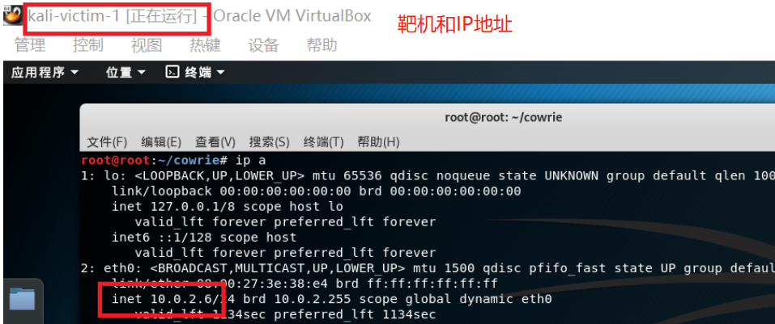

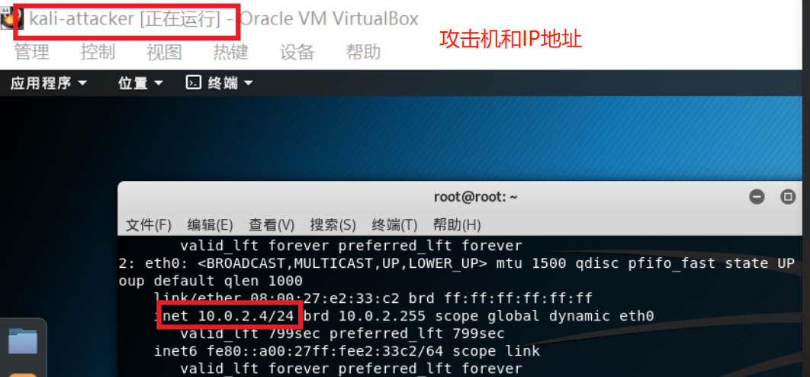

### 2、搭建蜜罐

- #### ssh_honeypot搭建

①将ssh_honeypot 克隆到本地。

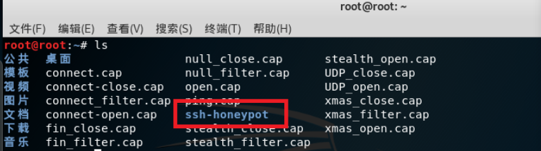

②修改端口号为56

指令：

```cmd
vi /etc/ssh/sshd_config
```

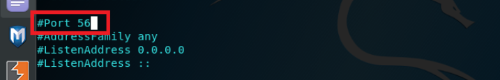

③重启ssh并安装docker

指令：

```
service ssh restart
apt-get install docker docker-compose
```

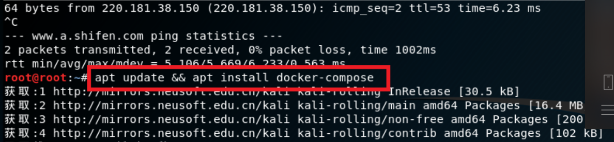

④根据参考文档中给出的步骤进行蜜罐搭建

```
apt install libssh-dev libjson-c-dev
```

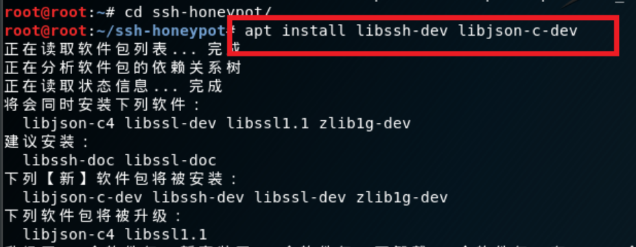

```
make
ssh-keygen -t rsa -f ./ssh-honeypot.rsa
bin/ssh-honeypot -r ./ssh-honeypot.rsa
```

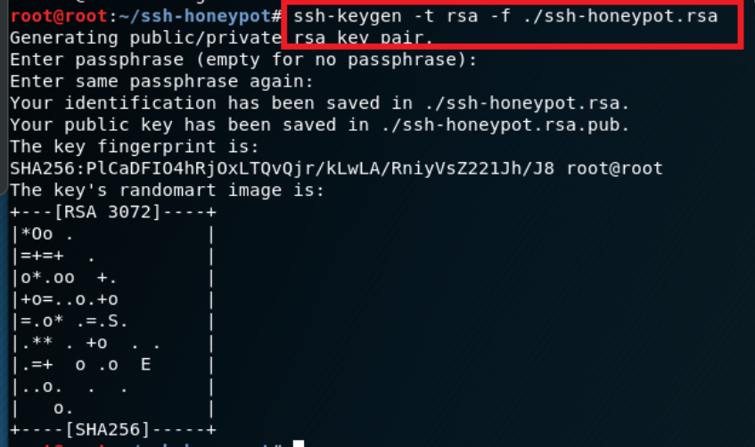

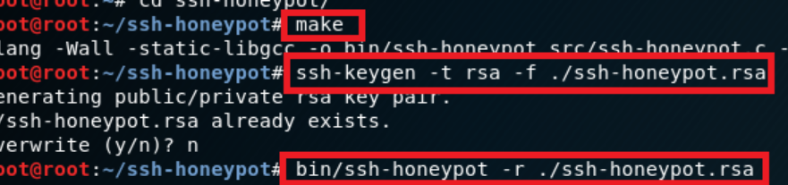

- #### cowrie搭建

①根据课本给出的参考地址将cowrie克隆到本地

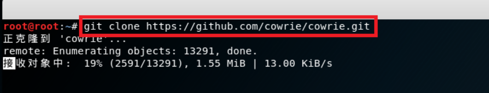

②安装镜像 

```
docker pull cowrie/cowrie
```

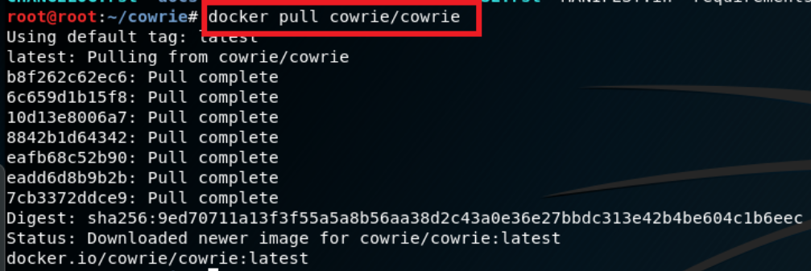

③运行cowrie

```
docker run -p 2222:2222 cowrie/cowrie
```


- #### 蜜罐测试

ssh-honey：攻击者无法连接靶机

cowrie：攻击者可以连接靶机，不管输入什么密码都可以成功登陆，同时在靶机的日志文件中可以看到攻击者主机的输入内容。

查看日志文件：

```
docker exec -it trusting_franklin tail -F /cowrie/cowrie-git/var/log/cowrie/cowrie.json
```

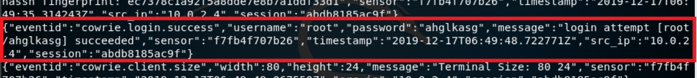

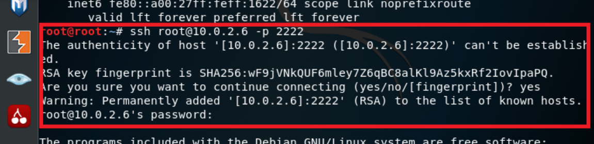

- #### nmap扫描

①ssh-honey

Tcp connect 端口为开启状态：

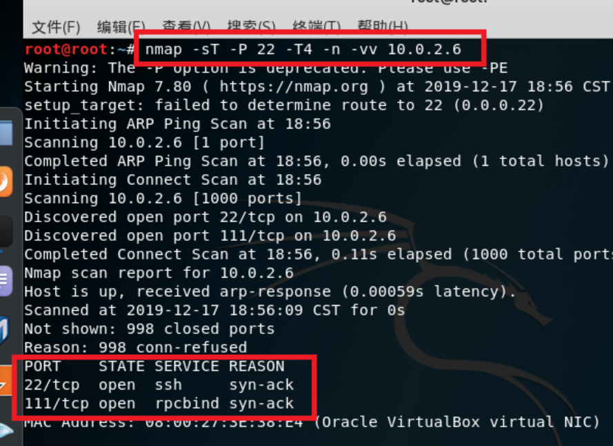

TCP stealth scan 端口为开启状态：

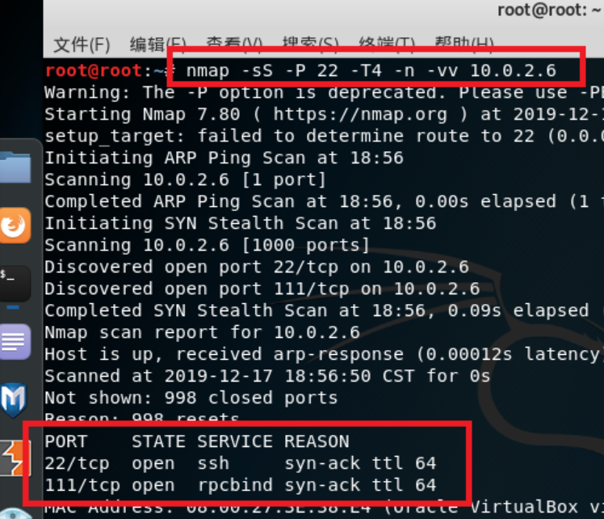

XMAS scan 端口为开启或过滤状态：

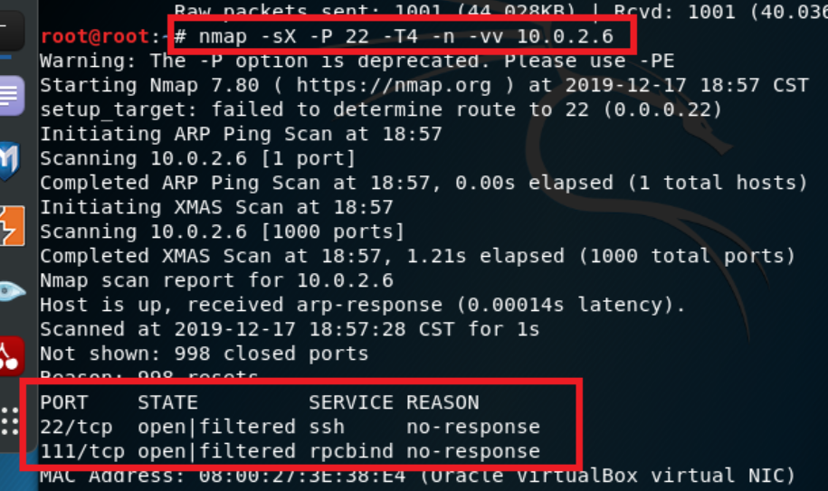

FIN scan 端口为开启或过滤状态：

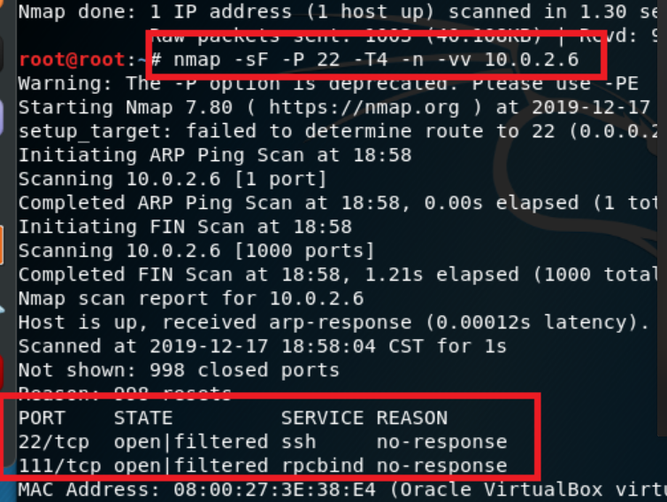

NULL scan 端口为开启或过滤状态：

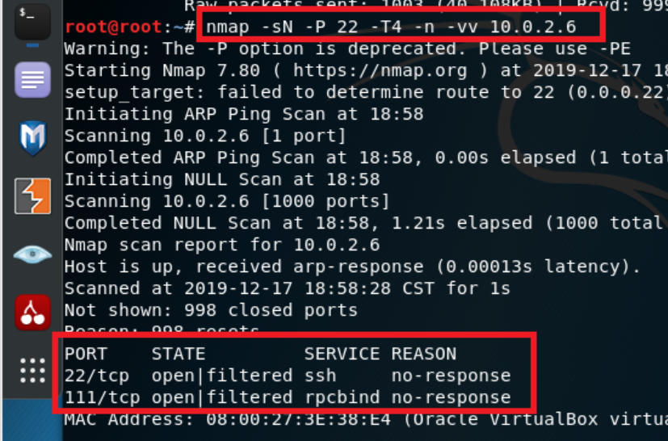

- 蜜罐日志中没有攻击者主机扫描端口操作的记录

②cowrie

Tcp connect 端口为开启状态：

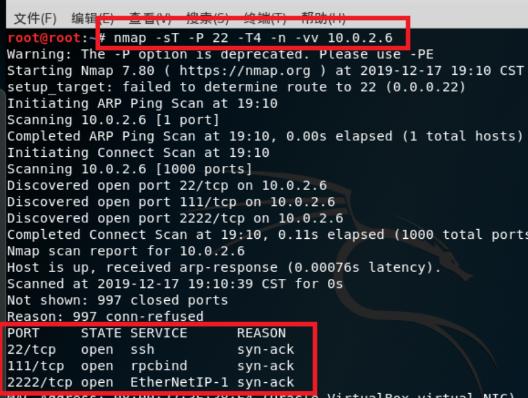

TCP stealth scan 端口为开启状态：

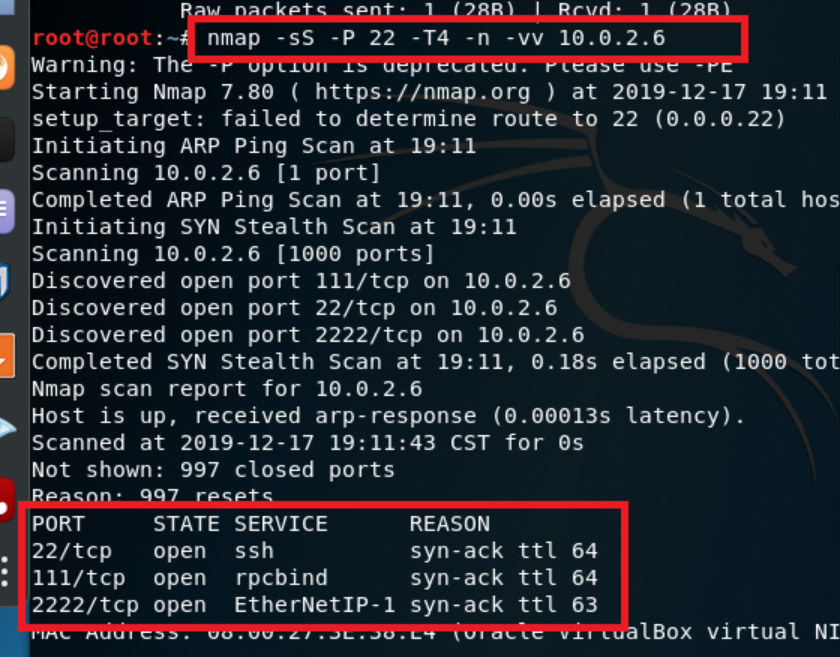

XMAS scan 端口为开启或过滤状态：

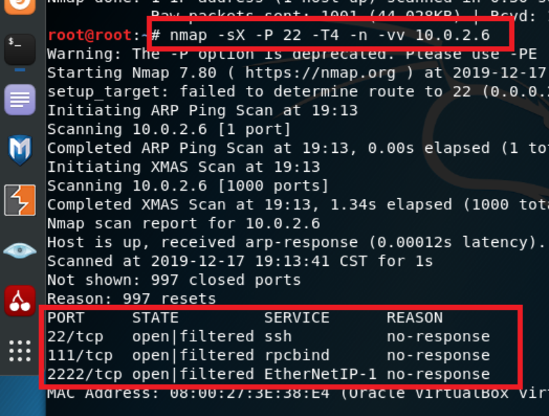

FIN scan 端口为开启或过滤状态：

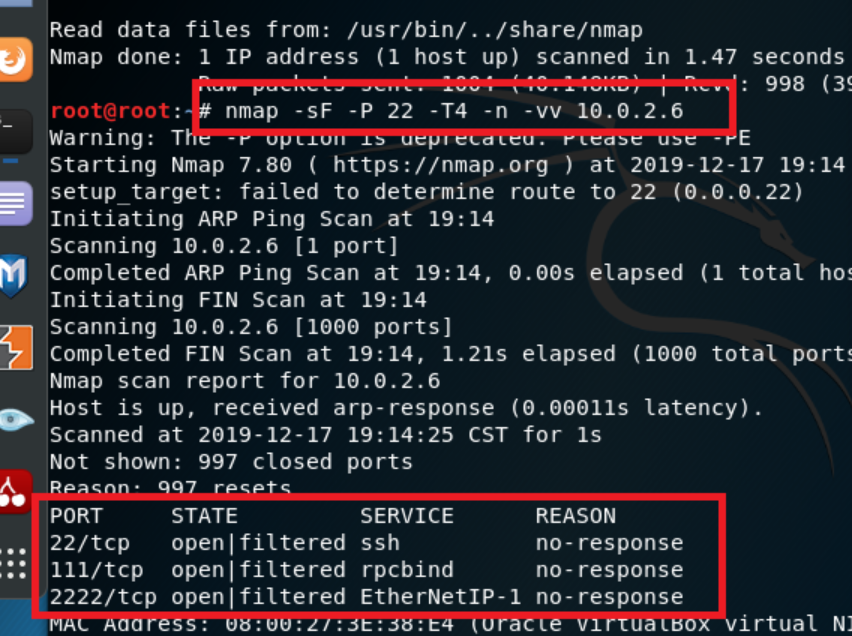
